# n8n-finance-automation
This project automates key finance operations for a business using n8n, an open-source workflow automation tool. It covers three workflows : monthly payroll distribution, overdue payment reminders, and sales invoice generation, all built on top of Google Workspace.


## Workflows Overview

### Automation 1 — Payroll: Payslip Distribution

**Trigger:** Monthly schedule

Reads employee data from a Google Sheet, generates a personalized payslip for each employee by populating a Google Docs template (name, designation, basic pay, allowances, deductions, net pay), downloads it, and sends it as an email attachment via Gmail.

**Flow:**
```
Schedule Trigger (monthly)
  → Google Sheets: Read employee details
  → Google Drive: Copy payslip template
  → Google Docs: Fill in employee data
  → Google Drive: Download as file
  → Gmail: Send payslip to employee
```

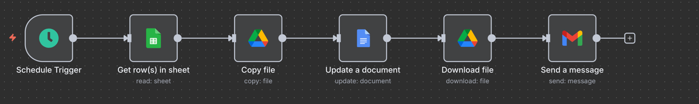
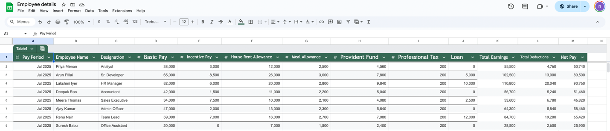
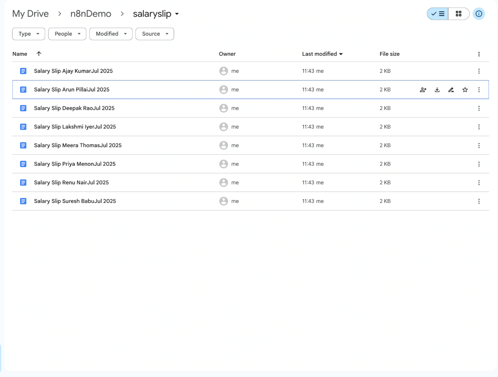
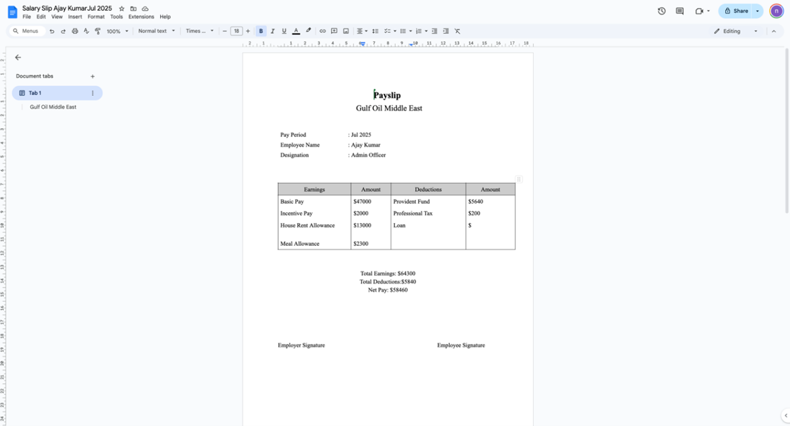
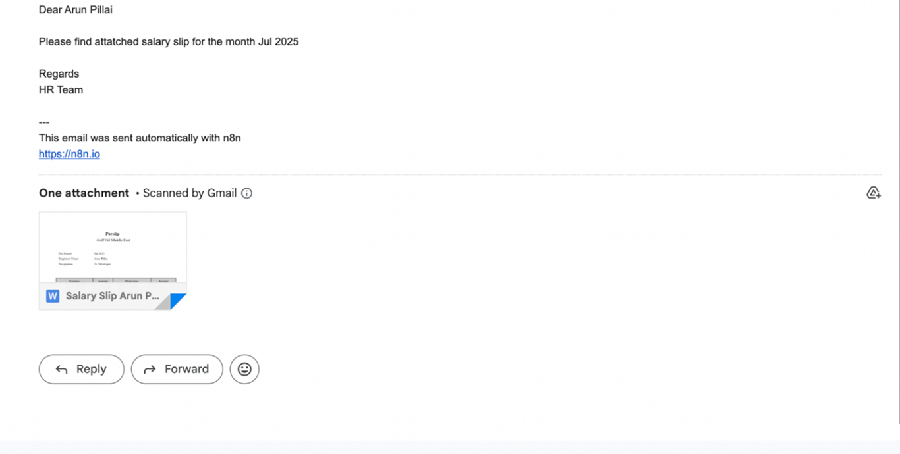

---

### Automation 2 — Accounts Receivable: Overdue Payment Reminders

**Trigger:** Monthly schedule

Reads a Google Sheet of client payment records, filters for clients whose payment status is "Not Paid", and sends each one a payment reminder email.

**Flow:**
```
Schedule Trigger (monthly)
  → Google Sheets: Read overdue payments sheet
  → IF: Payment Status == "Not Paid"
    → Gmail: Send overdue payment reminder
```

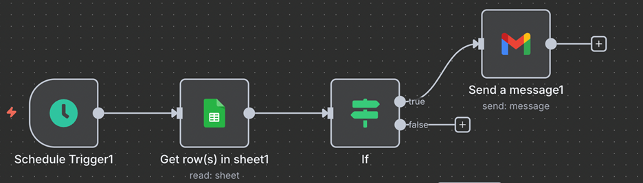
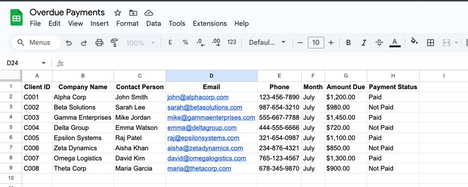
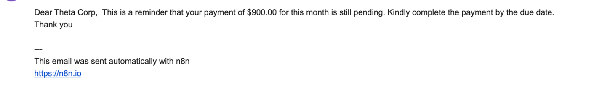

---

### Automation 3 — Accounts Receivable: Invoice Generation after Purchase Order

**Trigger:** Manual (Execute workflow button)

When a purchase order is placed, reads the customer order and product pricing sheets in parallel, merges them on product name, calculates Total, VAT (5%), and Total Amount Due, generates a personalized sales invoice from a Google Docs template, and emails it to the client as an attachment.

**Flow:**
```
Manual Trigger
  → Google Sheets: Read customer orders (parallel)
  → Google Sheets: Read product pricing (parallel)
  → Merge: Join on product name
  → Edit Fields: Calculate Total, VAT, Total Amount Due
  → Google Drive: Copy invoice template
  → Google Docs: Fill in invoice fields
  → Google Drive: Download invoice
  → Gmail: Send invoice to client
```

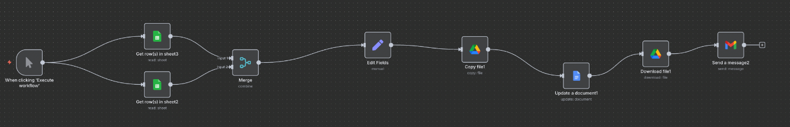
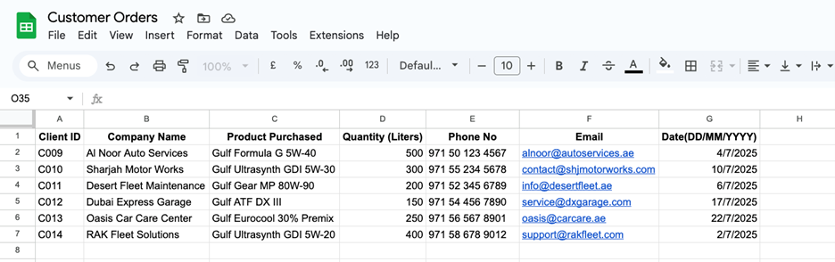
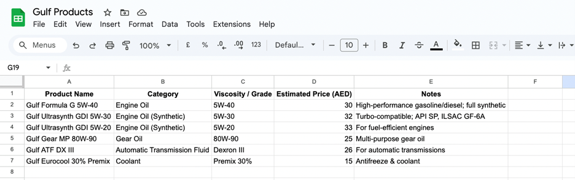
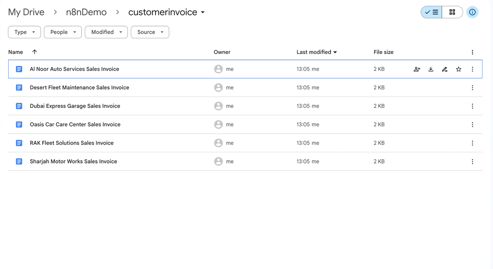
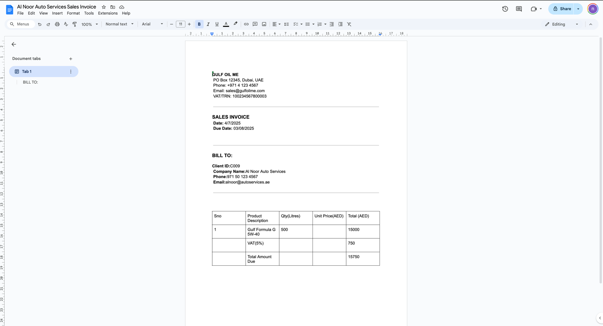
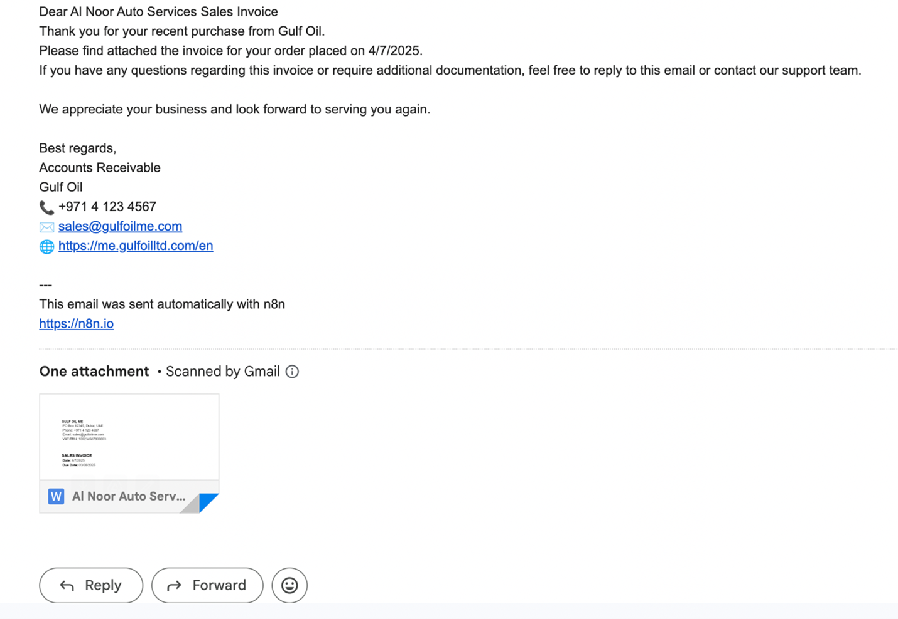

---

## Tools & Integrations

| Tool | Purpose |
|---|---|
| n8n | Workflow automation platform |
| Google Sheets | Employee data, client orders, product pricing, overdue payments |
| Google Docs | Payslip and invoice templates |
| Google Drive | Template storage and file management |
| Gmail | Sending emails (payslips, reminders, invoices) |
